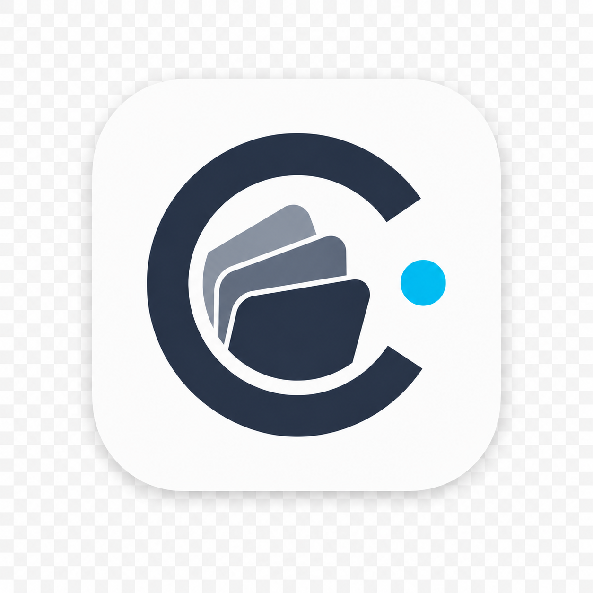

<p align="center">
  
</p>

<h1 align="center">Clawdeck</h1>

<p align="center">
  <em>The floating Claude Code companion for Windows.</em><br>
  <em>Permission prompts route through it · status lives at your screen edge</em><br>
  <em>· yesterday's sessions become tomorrow's flashcards.</em>
</p>

<p align="center">
  
  &nbsp;
  
  &nbsp;
  
  &nbsp;
  
  &nbsp;
  
</p>

<p align="center">
  <strong>English</strong> &nbsp;·&nbsp; <a href="README.zh.md">中文</a>
</p>

---

<p align="center">
  
</p>

<p align="center"><em>The orb tells you what Claude is doing at a glance — and the same orb fills clockwise as a 0–100% context meter (conic ring round its rim). No alt-tab.</em></p>

<p align="center">
  
</p>

<p align="center"><em>Drag it to any screen edge. When you're not looking at it, it tucks behind to a 4-px context-percent slit — out of the way, still glanceable.</em></p>

> Internally still referred to as **"Claude Code Companion"** in protocol code and env vars (`CCC_*`) — same project, mid-rebrand.

---

## Why this exists

Three Claude Code annoyances, all answered here:

| Annoyance | Clawdeck's answer |
|---|---|
| Permission prompts steal terminal focus | One click on the floating bubble, decision routes back to Claude, focus stays in your editor |
| You can't tell what Claude is doing without alt-tabbing | Ambient status orb at your screen edge — peripheral vision is enough |
| Brilliant moments from your sessions evaporate when the conversation closes | Daily flashcards, generated locally from yesterday's transcripts, every card cites a verbatim source line |

---

## 5 modes · one liquid morph

| Mode | Trigger | What it shows |
|---|---|---|
| **Compact** | resting state | status orb (animates by status, fills clockwise as a context-% conic ring) + status text + 4-px peek slit (linear context bar); auto-peeks when snapped to a screen edge |
| **Approval / Question** | auto on permission request | risk chip · tool / cwd / reason · Approve / Deny / Always-allow, or a freeform answer for question requests |
| **📚 Cards** | 📚 button | Today · History · Wrong-book · Generation Record |
| **⚙ Settings** | ⚙ button | left-rail nav: Knowledge cards · Storage · Export · Companion (themes + EN/中文 + hook status) |
| **⤢ Live** | ⤢ button | semi-transparent monitor with breathing pulse: today's deck summary + active Claude sessions |

The bubble morphs between every mode on a synchronized cubic-bezier curve — OS window resize and CSS `border-radius` bend on the same overshooting droplet stretch, so a mode change reads as **one** motion, not two.

<p align="center">
  
</p>

<p align="center">
  
</p>

---

## Knowledge Cards · Stage 1.5

Generated locally. Companion pipes a redacted slice of `~/.claude/projects/` JSONLs into a `claude -p` subprocess; the model returns cards keyed back to verbatim source quotes. **No hallucinations** — every card cites a real session line, the strict-source validator drops anything that doesn't match.

- ✅ **Strict source policy** — every card cites a real session line; optional web fallback cites the URL
- 🛡 **Redaction before send** — `.env*` adjacent lines dropped, token-shaped strings (GitHub PAT / Anthropic key / AWS key) substituted, usernames collapsed to `~`
- 🔒 **Local only** — uses your authenticated `claude -p`; no direct Anthropic API call from Companion
- 🗂 **Today · History · Wrong-book · Generation Record** tabs
- 🔁 **Wrong cards return** until mastered (consecutive-correct threshold scales with difficulty)
- 🔥 **Streak counter** survives one empty day with a 🛡 shield
- 🎚 **Difficulty preset** — Casual / Balanced / Deep adjusts the easy / medium / hard mix
- 📅 **Heatmap session picker** — drag-select which days feed the generator; Auto top-3 / All / None shortcuts
- 🌐 **Bilingual** — generator prompt + UI both branch on locale (English / 中文)
- ↓ **Markdown export** — Today, all abstracts, or wrong-book → pastes cleanly into Obsidian / Notion

First generation is gated by an **opt-in consent modal** explaining the data flow.

<p align="center">
  
</p>

---

## 4 themes · 0 paid skin packs

All four hold body-text contrast at WCAG-AA or better. Approve is always sage-green, Deny is always rose-red — no matter the theme.

| | | |
|---|---|---|
| **Midnight Teal** 深海青夜 | dark | cool dusk surfaces with teal accent (default) |
| **Amber Hearth** 暖夜炉火 | dark | warm browns + amber, easy on eyes after sundown |
| **Paper Light** 晨纸轻亮 | light | white surfaces, slate ink, calm accents — daytime |
| **Aurora Indigo** 极光紫夜 | dark | deep indigo + lavender + peach, cinematic |

The swatch button on the controls strip cycles through them; the previews in **Settings → Companion** let you pick directly.

<p align="center">
  
</p>

---

## 60-second start

> Requires **Node.js 20+** on Windows.

```powershell
npm install
npm run setup-user-hooks    # injects hooks into ~/.claude/settings.json (with backup)
npm run doctor              # confirms install
```

Two terminals:

```powershell
npm run daemon              # one terminal — http://127.0.0.1:4317
npm run desktop             # another — the bubble
```

That's it. Open Claude Code in any directory; permission prompts now route through the bubble.

### Kill-switch

The bubble's ⏻ button writes a flag file the daemon checks on every hook request:

```powershell
type nul > %USERPROFILE%\.claude-companion\disabled    # disable
del %USERPROFILE%\.claude-companion\disabled           # re-enable
```

When the flag is present every `/hook/*` endpoint returns a noop and Claude Code falls back to its native prompt — without uninstalling.

---

## Hooks Companion installs

Three Claude Code hooks, registered as native `"type":"http"` entries in `~/.claude/settings.json` by `setup-user-hooks` (or per-project after `setup-hooks -- <path>`). Verify install any time with `npm run doctor`.

| Hook | Fires when | What it does | Mode |
|---|---|---|---|
| `PreToolUse` | Before `ExitPlanMode` / `AskUserQuestion` (matcher path) and on every tool for the lifecycle event hook | Routes Claude's permission prompt through the bubble's approval card; the approve / deny / answer reply comes back as the hook's HTTP response | **blocking** — Claude waits for your decision |
| `PermissionRequest` | On any explicit `ask` permission decision | Surfaces the request in the bubble, awaits decide / approve / deny / answer over WebSocket | **blocking** |
| `Event` | On every Claude lifecycle event (`thinking`, `tool_started`, `tool_finished`, `done`, …) | Feeds session state to the bubble's status orb and the Live monitor session list | **non-blocking** — fire-and-forget |

`setup-user-hooks` writes JSON entries that POST directly to `http://127.0.0.1:4317/hook/<endpoint>`. There's no local hook script — Claude Code talks to the daemon natively, which means a daemon-down or Clawdeck-uninstalled scenario is a non-blocking error in Claude Code's native handler (Claude logs and proceeds), instead of a fail-closed lockup. Each entry carries a custom `"x-clawdeck-version"` field so future versions can detect-and-upgrade their own entries.

**Uninstall** without touching your other hooks:

```powershell
npm run setup-user-hooks -- --uninstall
```

The packaged `Clawdeck.exe` self-installs hooks on first launch and the NSIS uninstaller calls `--uninstall-hooks` before deleting the exe — manual `setup-user-hooks` is dev-mode only.

---

## Architecture

```
Claude Code (your terminal)
  ↓ hook (PreToolUse / PermissionRequest / Event)
Local daemon — http://127.0.0.1:4317
  ↕ ws://127.0.0.1:4317/ws    realtime events
Electron bubble (renderer + main)
```

HTTP endpoints (used by the bubble + any future client):

```
/sessions                  active Claude Code sessions
/pending-requests          permission requests awaiting decision
/permission-decisions      decision log
```

<details>
<summary><strong>Per-project hook install</strong> (legacy — only if you want hooks scoped to one repo)</summary>

```powershell
npm run setup-hooks -- D:\path\to\project
npm run setup-hooks -- D:\path\to\project --status-only
npm run setup-hooks -- D:\path\to\project --approval-only
npm run setup-hooks -- D:\path\to\project --disable
```
</details>

<details>
<summary><strong>Manual approval CLI</strong> (headless / scripting)</summary>

```powershell
npm run approve -- <requestId>
npm run deny -- <requestId> "Reason"
npm run answer -- <requestId> '{"Question text":"Answer label"}'
```

The Electron bubble does the same internally over WebSocket.
</details>

<details>
<summary><strong>Test hook endpoints directly</strong></summary>

```powershell
# blocking — gates approvals
curl -X POST http://127.0.0.1:4317/hook/pre-tool-use -H "content-type: application/json" -d '{"session_id":"t","tool_name":"Bash","tool_input":{"command":"echo hi"}}'

# non-blocking — feeds status / context
curl -X POST http://127.0.0.1:4317/hook/event -H "content-type: application/json" -d '{"session_id":"t","hook_event_name":"UserPromptSubmit","prompt":"hi"}'
```
</details>

<details>
<summary><strong>Re-render the demo APNGs in this README</strong></summary>

The animations on this page are auto-rendered from [`demo/bubble-mockup.html`](demo/bubble-mockup.html) by [`scripts/render-demos.js`](scripts/render-demos.js) — Playwright drives a headless Chromium through each sequence, ffmpeg crops + encodes APNG.

```powershell
winget install ffmpeg            # one-time
npx playwright install chromium  # one-time
npm run render-demos             # ~90 s, regenerates all 6 APNGs in media/
```

After every demo HTML change, just rerun `npm run render-demos`.
</details>

---

## What's shipped

| Stage | What | Released |
|---|---|---|
| **0** | Approval daemon + hook spike | v0.1 |
| **1** | Windows floating bubble (5 modes + liquid morph) | v1.0 |
| **1.5** | Knowledge Cards (Today / History / Wrong-book / Record · streak · heatmap picker · bilingual generator) | **v1.2.0** ← current |

---

<p align="center">
  <sub>Made for Windows.<br>Built end-to-end with Claude Code itself — the recursion is the whole point.</sub>
</p>
